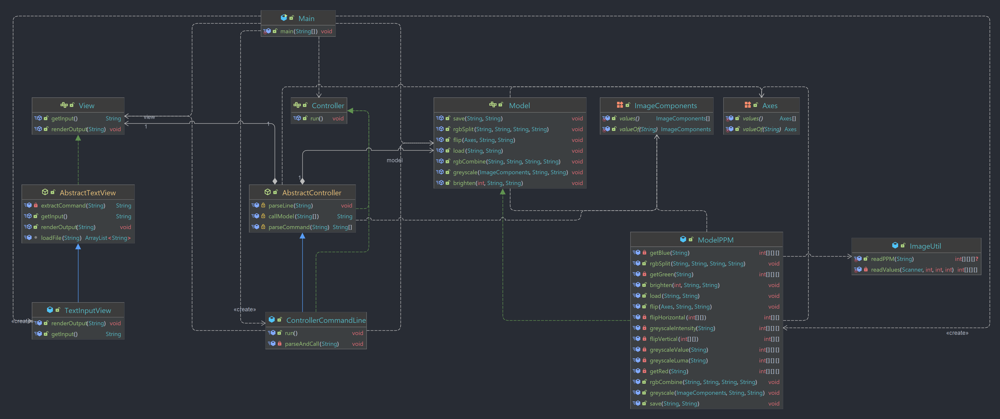
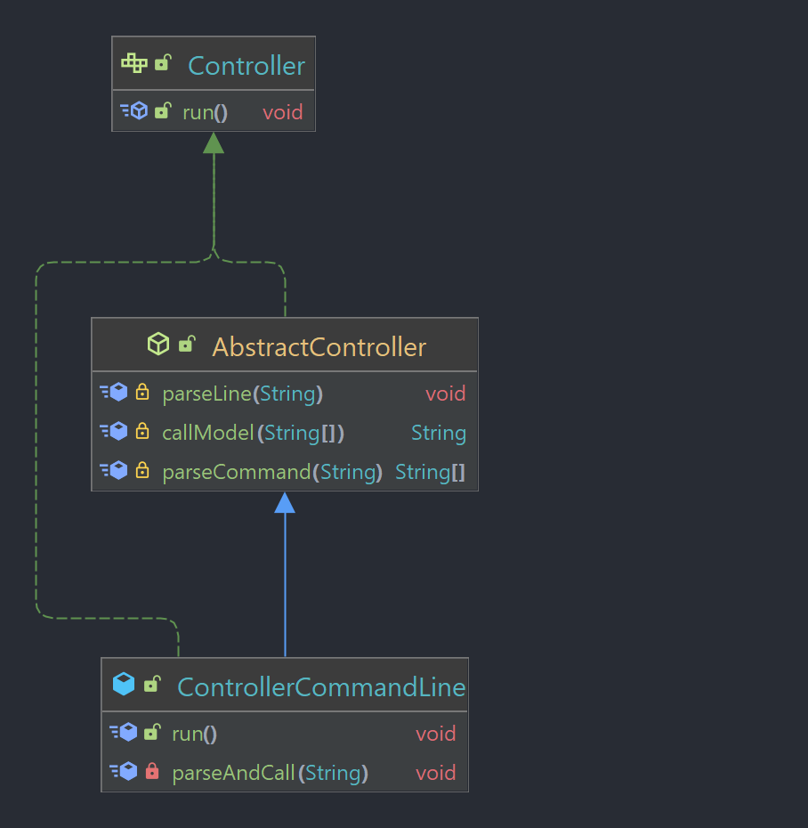

# Phase 1

## Group Members

- Javad Moein
- Tanmay Gadgil
- Seung Hun Lee

## Overview

This is an image processing application that aims to accept user commands either via command line
or by script to perform operations on a PPM image. The design is written as an MVC application.
Details of each component are described below. This version of the application can only handle PPM 
images but can be extended for other formats in the future. 

At a high level this is how the application functions:



## Class and Interface Definitions

### Model


The model implements the actual functionalities offered by the program.
In model module we have the following classes:

- **Model:** This interface represents possible actions to be done on a PPM file. This interface
  has the following methods:

    - load
    - save
    - greyscale
    - flip
    - brighten
    - rgbSplit
    - rgbCombine


- **MockModel:** This interface is a Mock of Model interface for testing the controller easier.
  This interface has the following methods:

    - getLog


- **ModelPPM:** The ModelPPM class represents a PPM image file and provides functionality for
  loading,
  saving, and modifying the image. This class implements Model interface.
  The image is stored as a HashMap where the key is a
  String representing the image name and the value is a three-dimensional array of integers
  representing the red, green and blue pixels.


- **ModelPPMMock:** This a Mock class of ModelPPM class for testing the controller easier, which
  implements MockModel.


- **Axes:** This enumerated type represents which axe should be considered for flip method.


- **ImageComponents:**  This enumerated type represents which component should be considered
  for the greyscale method.


- **ImageUtil:** This class contains utility methods to read a PPM image from file and simply
  print its contents.

### Controller




The view is the part of the program that shows results to the user.

- **Controller:** The given code represents an interface called "Controller" in the "controller" package of a Java application. The purpose of this interface is to provide a common contract for any class that wants to act as a controller in the Model-View-Controller (MVC) architecture.
The interface has one method called "run()" which takes no arguments and returns void. This method is used to execute inputs from the view in a loop.
- **AbstractController:** This class is an abstract controller that implements the Controller interface. It provides a set of methods that all controllers need, such as parsing commands, calling the model, and rendering the output to the view.
- **ControllerCommandLine:** This class represents the command line implementation of the controller interface. It allows users to run commands through a model using a command line interface, and has a function called "parseAndCall" which parses input files and calls model functions.

### View


The controller takes inputs from the user and tells the model what to do and the view what to show.

- **View:** This is an interface for a view in a software system, which defines the two methods: getInput() to get input in a specific format and renderOutput() to output a string depending on the implementation.
- **MockScriptView:**  This is a Java class named "MockScriptView" that implements the "View" interface. It is a mock model of the view that is used for testing. It can read from a file and simulate user input, depending on the specified mode.
- **TextInputView:** The TextInputView class is a subclass of AbstractTextView and provides a command-line interface for user input. It has two modes, "command" and "script", with the former taking input directly from the user and the latter executing commands from a file in sequence until the end of the file or the command "exit" is reached.

## Commands

### Accepted commands

Here is a list of accepted commands for both the command mode and the script mode.

1. load <image-path> <image-name>
2. save <image-path> <image-name>
3. greyscale <component-name> <image-name> <dest-image-name>
4. horizontal-flip <image-name> <dest-image-name>
5. vertical-flip <image-name> <dest-image-name>
6. brighten <increment_value> <image-name> <dest-image-name>
7. rgb-split <image-name> <dest-image-name-red> <dest-image-name-green> <dest-image-name-blue>
8. rgb-combine <image-name> <red-image> <green-image> <blue-image>

The main script of this application is run using the Main.java class found in the src/ folder

The first step is to compile the classes to ensure that they run in the terminal
To compile the code

#### Before running the script:

1. First be in the [src/](src) directory
    ```shell
   cd src/
   ```
2. Run the compilation script
    ```shell
    sh compile_all.sh
    ```

#### Running the Script:

**Command line mode**

In this mode the app runs when the user gives command line inputs into the terminal
To run the script:

```shell
cd src/
```

```shell
java Main.java
```

To exit the application enter the command ```exit``` or use ```ctrl-c```

**Scripting mode**

This mode accepts a script to run. This script is a text file which lists out all the
commands that can be given in the terminal. To add a comment add in text following a ```#```
character

To run the application script mode attach the -s flag to the command line arguments

```shell
cd src/
```

```shell
java Main.java -s <location of script file.txt>
```

### Sample Scripts

Run these sample scripts for the following use cases

#### Running in command mode

First execute

```shell
>>> cd src/
>>> java Main.java
```

Then execute the following commands **one at a time**

```shell
>>> load sample.ppm scene

>>> vertical-flip scene scene-vertical

>>> rgb-split scene scene-red scene-green scene-blue

>>> save scene-red.ppm scene-red

>>> save scene-green.ppm scene-green

>>> save scene-blue.ppm scene-blue
```

#### Running in script mode

```shell
>>> cd src/
>>> java Main.java -s testScript.txt
```

test